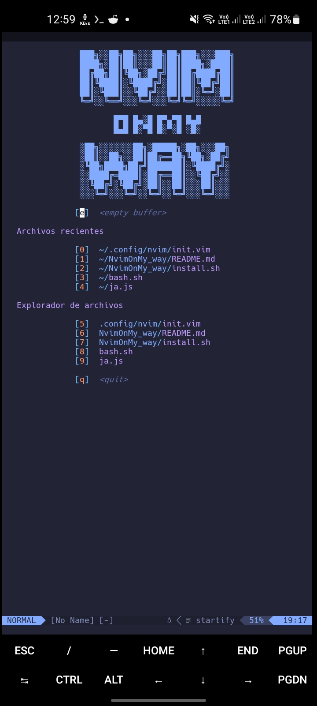
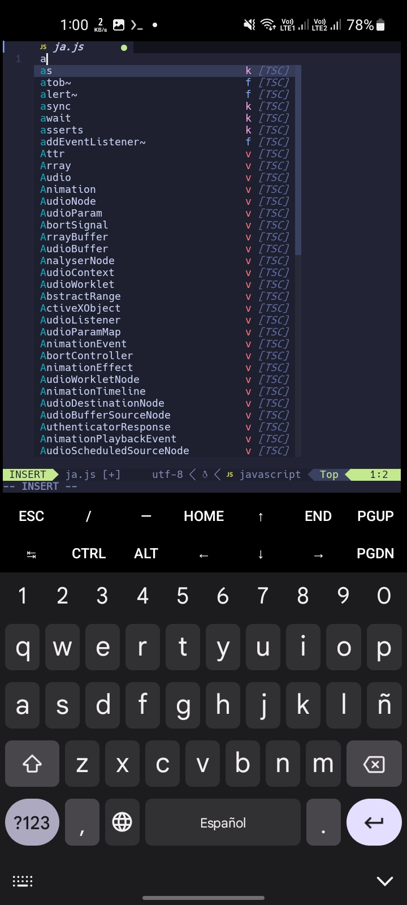
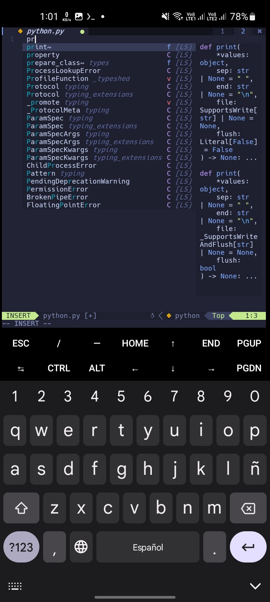

 <p align="center">
   <h1>NvimOnMy_Way</h1>
 </p>
 __This neovim configuration can only be used in termux, but I plan to make it compatible with most Linux distributions in the future..__

- [Captures](#captures)
- [Requirements](#requirements)
- [Installation](#installation)
- [Plugins](#plugins)


## Captures






# Requirements

- Termux (obviously)
- Python 3.6 aor higher
- pip
- Neovim 7.4 or higher
- NodeJS
- yarn
- lua5.3

*__If you don't have any of these packages installed, the installation script will install them for you.__*

# Installation
You should clone this repository using git (if you don't have git installed, you can install it with apt install git or pkg install git) and run the installation script with the following commands:

```
git clone https://github.com/RchrdAlv/NvimOnMy_way
cd NvimOnMy_way
./install.sh
cd ..
rm -rf NvimOnMy_way
```
Now you just have to open 'nvim' and wait for it to be fully configured.

### _That's it, enjoy your new text editor._

## Plugins

The following plugins will be installed:

```

folke/tokyonight.nvim
neoclide/coc.nvim', {'branch': 'release'}
nvim-tree/nvim-web-devicons
nvim-lualine/lualine.nvim
nvim-lua/plenary.nvim
neovim/nvim-lspconfig
SmiteshP/nvim-navic
akinsho/bufferline.nvim', { 'tag': '*' }
nvim-tree/nvim-tree.lua
kyazdani42/nvim-web-devicons
mhinz/vim-startify
ms-jpq/chadtree
github/copilot.vim
```
You can search for them on GitHub to see their documentation.
